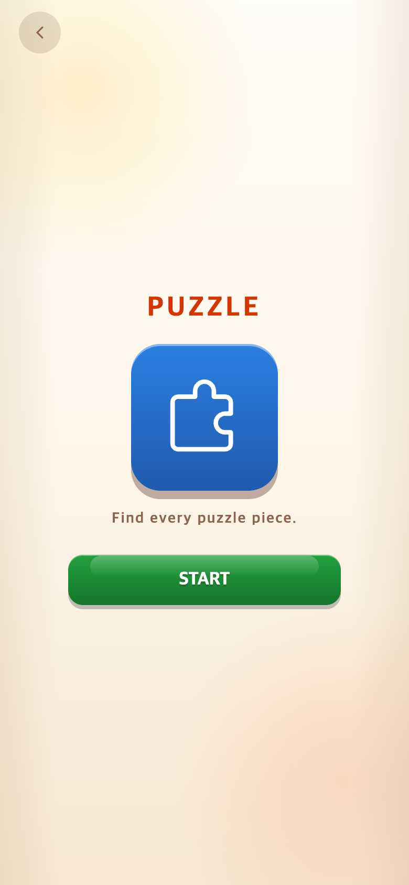
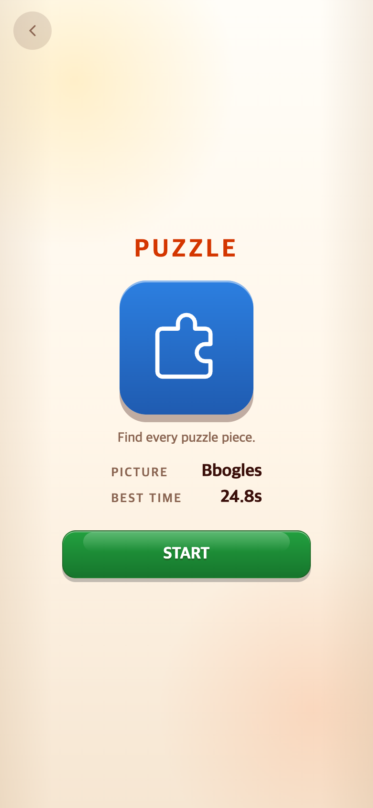
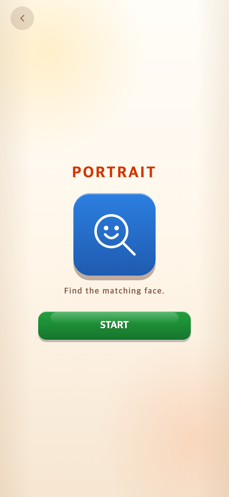
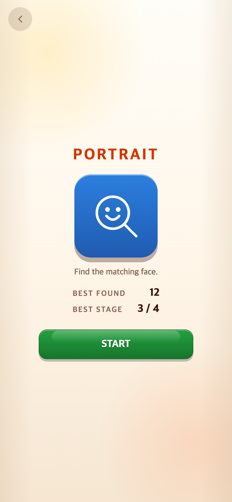
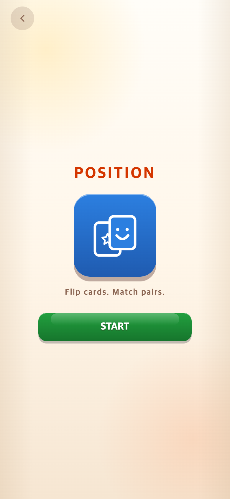
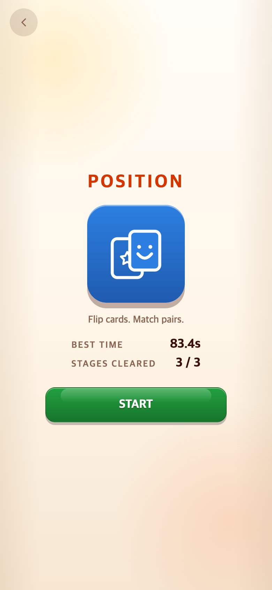

# START 화면 최고기록 검토 후 취소

## 최종 결정 — 2026-09-28 취소

사용자는 단발성으로 가볍게 즐기는 시작 화면을 유지하기로 했다. 바로 전 작업의 START 최고기록 표시·관련 레이아웃 변경·퍼즐 사전 추첨·조회용 코드와 전용 테스트를 모두 취소했다. 게임 실행 코드는 변경 전 `802721222022771044a676f4e36a670d8a53a631`과 동일하게 복구했다. 기존 결과창과 기록 저장은 유지하며 사용자 저장 데이터는 삭제하지 않았다. 이 실험은 푸시하지 않았다.

앱 전용 저장소 보강 및 실제 앱 업데이트 후 기록·설정 유지 확인은 **추후 별도 요청 시 진행할 계획**이다. 별도 클라우드 서버나 계정 동기화는 만들지 않는다. 이번에 저장소 이관이나 앱 설치·업데이트 검증을 수행한 것은 아니다.

아래 설명·비교 캡처·`check.cjs`·`verification.json`은 **취소된 실험의 역사 자료**로만 보존한다. 현재 화면은 `before-*.png`에 해당하며, 당시 실험용 검증 스크립트는 현재 코드에 적용하지 않는다.

## 당시 문제와 실험 변경 (현재 미적용)

기존에는 게임을 끝낸 뒤 결과창에서만 최고기록을 볼 수 있었다. 다시 도전하기 전에 목표를 알 수 있도록 설명 아래, START 버튼 바로 위에 기록을 추가했다. TAPtoTEN의 LIMITLESS 시작 화면을 읽기 전용으로 비교했으며 다른 게임 저장소는 수정하지 않았다.

| 게임 | 첫 번째 줄 | 두 번째 줄 |
| --- | --- | --- |
| PUZZLE | PICTURE: 이번에 플레이할 그림의 캐릭터 이름 | BEST TIME: 해당 그림의 가장 빠른 완성 시간 |
| PORTRAIT | BEST FOUND: 한 판에서 가장 많이 찾은 수 | BEST STAGE: 해당 최고기록의 도달 단계 / 4 |
| POSITION | BEST TIME: 3단계 전체의 가장 빠른 완주 시간 | STAGES CLEARED: 해당 최고기록의 완료 단계 / 3 |

처음 방문하거나 해당 그림을 아직 완성하지 않았다면 시간은 `—`로 표시한다. POSITION의 미완주 기록은 완료 단계만 보여주며 실패 시간을 완주 기록처럼 표시하지 않는다. 단순히 시작 화면을 열거나 닫는 동작으로는 기록이 저장되지 않는다.

PUZZLE 기록은 원래 그림 ID·조각 수별로 분리되어 있다. 따라서 안내 진입 시 이번 그림을 미리 추첨하고 START에서 같은 그림을 사용한다. 기존 12종 목록과 균등 추첨은 유지하며 보드·타이머는 START를 눌러야 시작한다. PORTRAIT의 캐릭터 순서도 시작 전에는 소모하지 않는다.

## 모바일 화면 비교

모두 390×844 CSS px, DPR 2로 캡처한 **780×1688px** PNG다. 원본 캡처 크기를 유지하며 리사이즈하지 않았다. 변경 후의 24.8초·12개·83.4초는 표시 검증용 예시 기록이며 사용자 실제 기록이 아니다.

| 화면 | 변경 전 | 변경 후 |
| --- | --- | --- |
| PUZZLE |  |  |
| PORTRAIT |  |  |
| POSITION |  |  |

[TEN 비교 화면](reference-ten.png) · [기록 없는 첫 방문](after-first-visit.png) · [자동 플레이로 최고기록 갱신 후](after-improved.png)

라벨은 13px·700·자간 0.1em, 값은 18px·800·오른쪽 정렬·고정폭 숫자다. TEN과 같은 시스템 서체·색상, 행 간격 6px·열 간격 20px를 사용한다. 짧은 화면에서는 아이콘과 상단 높이를 줄이고, 가로 화면에서는 스크롤로 START에 접근할 수 있다.

## 검증과 재현

- 변경 전 기준: PICK `802721222022771044a676f4e36a670d8a53a631`.
- 비교 기준: TEN `2515854260cbc2e9a6d2950499238649644d28f0`.
- `capture-before.cjs`: 코드 변경 전에 캡처했다. 기존 캡처 덮어쓰기를 거부한다.
- `check.cjs`: 별도 Chrome 브라우저 컨텍스트에 예시 기록을 넣어 검사한다. 사용자의 브라우저 저장소는 읽거나 수정하지 않는다.
- 390×844, 390×667, 320×568, 844×390에서 세 게임의 겹침·가로 넘침·START 접근성을 확인한다. 세로 화면에서 제목·아이콘·설명·기록·START의 세로 위치와 기록 서체·간격을 TEN과 비교한다.
- 기록이 없는 방문, 안내 취소, 안내 중 타이머 미진행·저장소 무변경, 실제 퍼즐 정답 클릭 후 갱신, Play again과 새로고침 후 유지, 안내 그림과 실제 문제 일치를 검증한다. 영상 종료만 테스트 이벤트로 제어한다.
- Vitest 29개 파일·287개 테스트, TypeScript 검사, 프로덕션 빌드 통과. 브라우저 결과와 이미지 SHA-256은 `verification.json`에 기록한다.

로컬 PICK/TEN 서버를 각각 5239/5240 포트에서 실행한 뒤 Playwright를 사용할 수 있는 Node 환경에서 `node docs/research/2026-09-28-intro-records/check.cjs`로 재현한다. `BASE_URL`, `TEN_URL`, `CHROME_PATH` 환경변수로 서버·Chrome 경로를 바꿀 수 있다. 테스트는 Vite 개발 서버의 콘텐츠 모듈을 읽는다.

## 저장 유지 범위

이번 수정은 기존 `taptopick.records.v1`을 읽어 표시하는 UI 변경이다. 기록 삭제·저장 형식 변경·클라우드 동기화·네이티브 저장소 이관은 하지 않았다. 예전 4단계 POSITION 기록은 보존하되 현행 3단계 기록과 혼합하지 않는다.

현재 PICK 기록은 브라우저/WebView의 localStorage에 있다. 페이지 새로고침 후 유지는 검증했지만 이는 휴대폰 앱의 설치·업데이트 테스트가 아니다. [Capacitor 공식 문서](https://capacitorjs.com/docs/apis/preferences)는 모바일 OS가 localStorage 데이터를 정리할 수 있으므로 앱의 영구 설정·기록에는 네이티브 Preferences 사용을 권장한다.

출시 전에는 기존 기록 이관, 동일 앱 ID·키 유지, 실제 기기의 구버전 → 업데이트 보존 테스트가 필요하다. 앱 삭제·데이터 초기화·기기 교체 후의 복구는 별도 백업/계정 동기화 없이는 보장하지 않는다.
