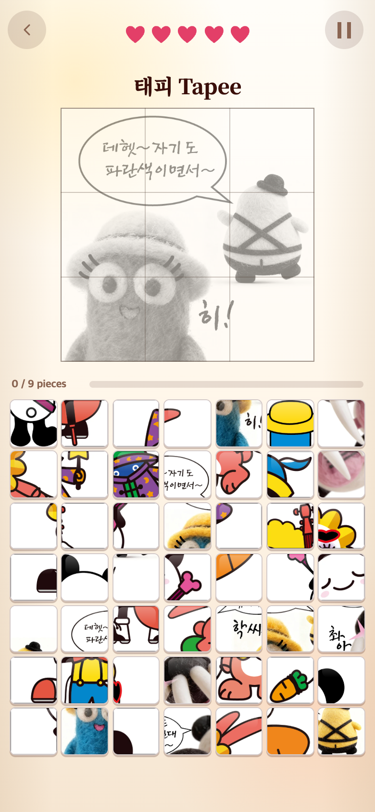
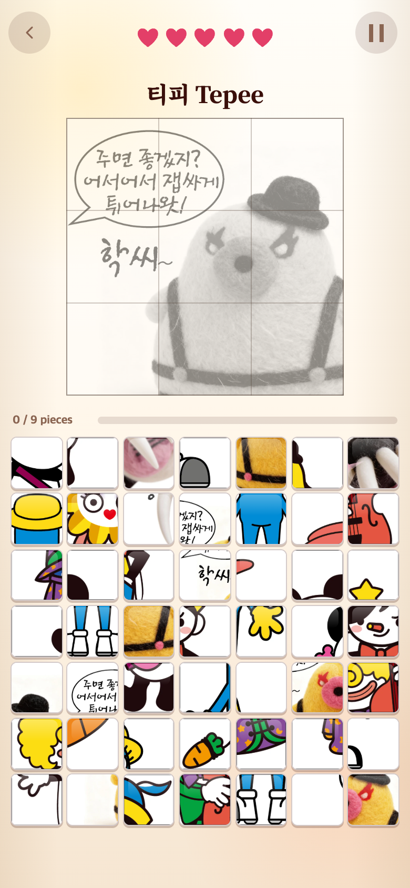
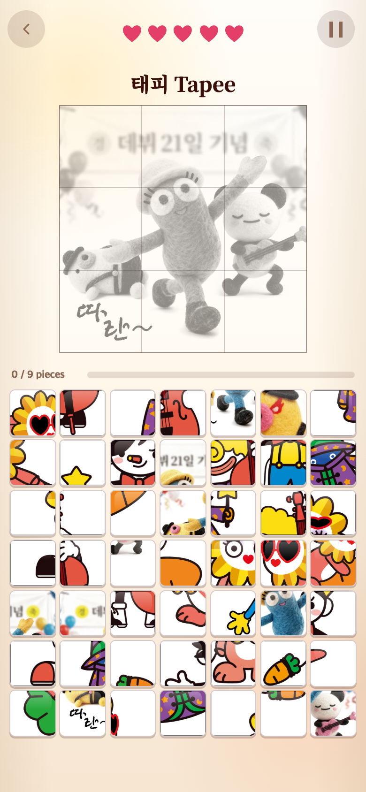
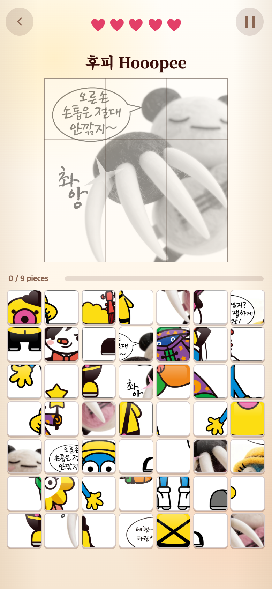
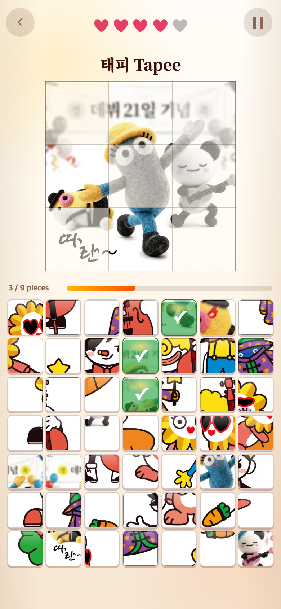

# 만화 4종을 9조각 퍼즐로 추가 — 2026-09-29

## 요청과 처리

제공된 만화 JPG 4장을 게임 1에 추가하되, 흰 여백을 넣지 않고 가장자리만 조금 잘라 정사각형으로 만들었다. 네 장 모두 원본 크기는 720×702px였으며 가로 18px(2.5%)만 제거하면 정사각형이 된다. 원본 파일은 변경하지 않고 저장소의 `assets/puzzle-originals/comics/`에 복사해 보관했다.

| 원본 | 왼쪽 제거 | 오른쪽 제거 | 결과 | 대표 이름·완료 영상 |
| --- | ---: | ---: | --- | --- |
| A-1-1-4.jpg | 9px | 9px | 702×702 | 태피 Tapee |
| A-2-2-4.jpg | 0px | 18px | 702×702 | 티피 Tepee |
| A-4-2-4.jpg | 9px | 9px | 702×702 | 태피 Tapee |
| A-16-3-4.jpg | 9px | 9px | 702×702 | 후피 Hooopee |

두 번째 그림은 왼쪽 끝의 말풍선 꼬리가 잘리지 않도록 크롭 위치를 조정했다. 위·아래는 전혀 자르지 않았다. 본문 글씨와 말풍선을 보존하고, 이미 원본에서 화면 밖으로 이어지는 몸·소품의 좌우 가장자리만 소폭 줄었다. 흰 여백 추가, 비율 변형, 업스케일, 생성형 이미지 수정은 없다.

## 퍼즐 적용

- 기존 7종과 추가 그림 5종은 모두 유지하고 만화 4종을 더해 **총 16종**을 무작위 제시한다.
- 각 만화는 234×234px 9조각, 왼쪽 위부터 가로 방향으로 번호를 매긴다.
- 위쪽은 외곽 테두리와 3×3 그리드가 있는 회색 그림이고, 정답을 맞힌 구획만 컬러가 된다.
- 각 49칸 보드는 **정답 9 + 어려움 2 + 중간 12 + 쉬움 26**으로 구성한다.
- 여러 캐릭터가 나온 그림도 구성원을 함께 기록한다. 목표와 오답 그림 사이에 공통 캐릭터가 한 명이라도 있으면 어려운 조각으로 분류해 **합산 최대 2개**로 제한한다. 캐릭터별로 2개씩 넣지 않는다.
- 이름과 성공 영상은 중심 인물 기준이다. 그 외 생명·점수·기록·실패 영상·게임 2/3·디자인은 바꾸지 않았다.

## WebP 최적화와 경계 일치

`scripts/split-unit-image.cjs`에 `crop` 옵션을 추가했다. 사진 한 장을 WebP 품질 90으로 먼저 압축한 후, 디코딩된 완성 그림을 기준으로 9조각을 무손실 저장한다. 조각을 합친 결과와 게임의 완성 그림은 픽셀 단위로 일치한다. 원본 JPG와의 무손실 일치를 뜻하는 것은 아니다.

4종 완성 그림 + 36조각, 총 40개 게임용 파일의 합계는 **1,334,302바이트(약 1.33MB)**다. 최초 무손실 변환 결과 2,599,770바이트 대비 약 49% 감소했다. 보관 원본은 게임 빌드에 포함하지 않는다. 이번 변경으로 기존 12종 이미지 파일을 재생성하지 않았다.

```sh
node scripts/split-unit-image.cjs assets/puzzle-originals/comics/A-1-1-4.jpg ComicA114 crop 9 90
node scripts/split-unit-image.cjs assets/puzzle-originals/comics/A-2-2-4.jpg ComicA224 crop 0 90
node scripts/split-unit-image.cjs assets/puzzle-originals/comics/A-4-2-4.jpg ComicA424 crop 9 90
node scripts/split-unit-image.cjs assets/puzzle-originals/comics/A-16-3-4.jpg ComicA1634 crop 9 90
```

실행 환경에 `sharp`가 필요하다. 옵션 없는 기존 명령의 여백 방식·960px·무손실 동작은 유지한다.

## 모바일 화면

Chromium 모바일 에뮬레이션 390×844 CSS 픽셀, DPR 2(780×1688 PNG)에서 실제 실행 화면을 캡처했다. 목표 순서와 보드를 재현하기 위해 START 시 난수를 제어했으며, 게임 상태나 표시 그림을 합성하지 않았다. 실제 휴대폰 촬영이나 사용자 실험 자료는 아니다.

| A-1-1-4 | A-2-2-4 |
| --- | --- |
|  |  |

| A-4-2-4 | A-16-3-4 |
| --- | --- |
|  |  |

정답 3조각을 맞힌 모습(그 전에 오답 1회):



## 검증

- `npm test`: **28개 파일, 293개 테스트 통과**. 16종 × 50회 = 800개 보드에서 구성·중복·정답 수를 검사하고 여러 캐릭터의 합산 상한도 별도 검증했다.
- `npm run build`: 타입 검사와 프로덕션 빌드 통과.
- 새 만화 4종의 702×702 완성 그림, 234×234 조각, 9조각 재조립 픽셀 일치 확인.
- 기존 해피 당근 이미지를 임시 폴더에서 기본 옵션으로 다시 생성해 완성 그림·9조각 모두 기존 파일과 픽셀이 같음을 확인.
- 모바일 390×844에서 16종, 320×568에서 새 4종, 총 20회 플레이 검증. 이미지 정상 로딩·화면 안 배치·정사각형 타일·정답 9/12개·오답 1회 생명 감소·3조각 및 전체 컬러 복원 확인. 실행 오류 0건.
- 등록된 이미지 프리로드 목록 354개 모두 중복 없음. 만화 이미지는 PORTRAIT·POSITION에서 사용하지 않는다.

TAPtoTALK·TAPtoTEN과 사용자 원본 폴더는 수정하지 않았다. 연구기록은 게임 실행에 포함되지 않는다. 아직 푸시하지 않았다.
