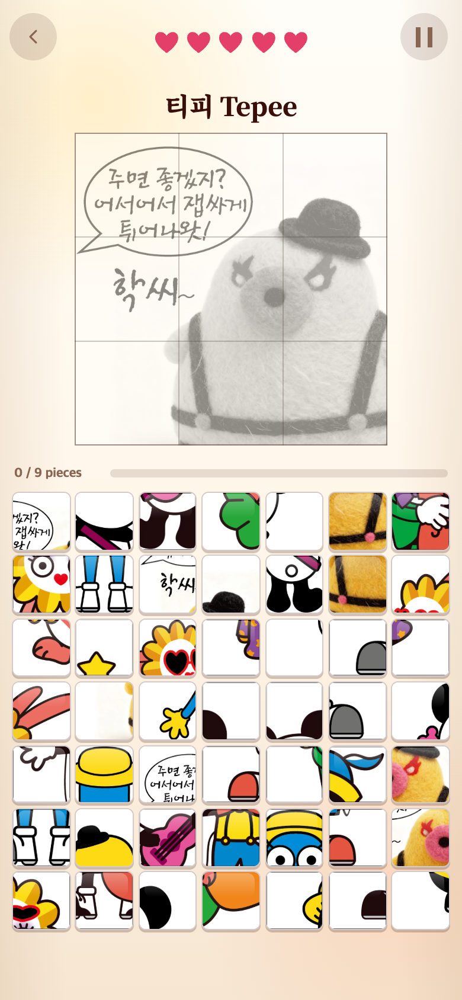
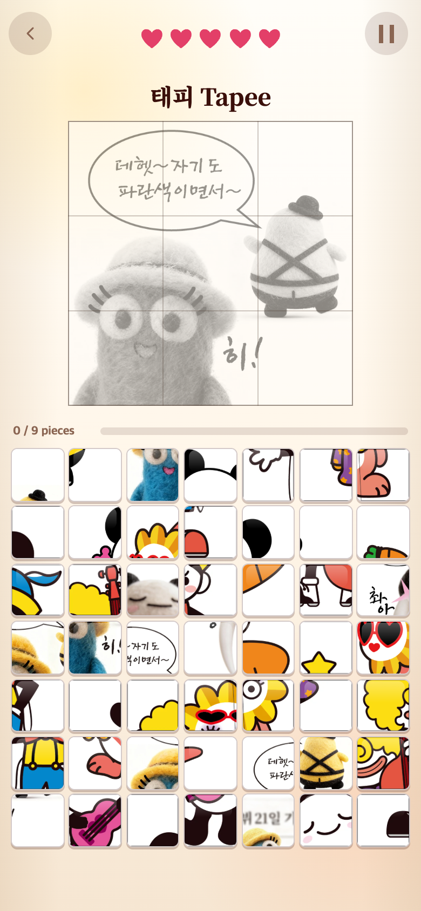
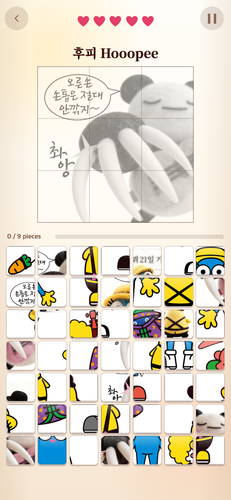

# PUZZLE: 전체 그림을 한 번씩 보여주는 랜덤 순환

## 문제

퍼즐은 기존 캐릭터 7종 + 추가 그림 5종 + 만화 4종으로 총 16종이다. 이전에는 START마다 전체 목록에서 독립적으로 추첨하므로, 아직 보지 못한 그림이 있어도 같은 그림이 다시 나올 수 있었다.

## 수정

- 16종을 무작위로 섞은 뒤 하나씩 제시한다. 모두 제시하면 다시 섞는다.
- 묶음 경계에서도 마지막 그림과 다음 첫 그림이 연속해서 나오지 않는다.
- 메뉴 복귀·실패·성공 후 Play again에도 남은 순서를 이어간다. 시작했다가 중단한 그림도 이미 제시된 것으로 센다.
- START를 누르지 않은 안내 화면 취소, 오답, 일시정지는 순서를 소비하지 않는다.
- PORTRAIT의 캐릭터 순환과 별도 상태를 사용한다. 다른 게임을 거쳐 돌아와도 PUZZLE 순서는 유지된다.
- 같은 캐릭터의 서로 다른 그림은 각각 별도 퍼즐이다. 중복 방지 기준은 그림 ID다.
- 새 그림을 콘텐츠 목록에 등록하면 전체 목록 길이에 따라 순환 수가 자동으로 늘어난다.
- 순서는 현재 페이지 실행 동안만 유지한다. 새로고침·페이지 재실행은 새 랜덤 순서로 시작한다. 저장 기록이나 클라우드 기능은 변경하지 않았다.

기존 `core/pick/game.ts`의 `RandomIndexCycle`을 재사용했고, UI에서 별도 셔플을 구현하지 않았다. 그림·7×7 보드·오답 난이도·점수·결과 영상·레이아웃은 그대로다.

## 검증

- Vitest: 28개 파일, 296개 테스트 통과. 7·16·17종 목록에 대해 각각 50개 시드로 순환 경계를 검사했다.
- 실제 등록된 그림 전체가 매 묶음에 한 번씩 포함되는지 5묶음 검사했다.
- 타입 검사와 배포 빌드 통과.
- 모바일 Chrome 390×844 CSS px, DPR 2에서 실제 START 33회 검증. 1–16번째와 17–32번째가 각각 16종 전체이며 16→17, 32→33의 연속 중복도 없었다.
- 성공·실패 후 Play again, 안내 취소, 일시정지·재개, 일시정지에서 메뉴 복귀, PORTRAIT·POSITION 방문을 함께 검사했다.
- 모든 보드는 정사각형 49칸, 정답 조각 수 유지, 이미지 로딩 정상. 브라우저 실행 오류 0개.

[실제 제시 순서와 검증 결과](verification.json)

## 모바일 화면

화면 디자인 변경이 아닌 추첨 방식 변경이므로 아래는 수정 후 실제 연속 플레이의 표본이다. 캡처는 780×1688px이다.

### 첫 번째 그림

### 첫 묶음 마지막: 16번째 그림

### 새 묶음 첫 번째: 17번째 그림

이번 검증에서는 16번째 `comic-a-1-1-4` 다음에 17번째 `comic-a-16-3-4`가 나왔다. 실제 사용자에게는 매 실행마다 다른 랜덤 순서가 만들어진다.
