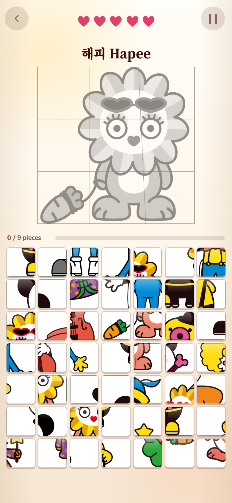
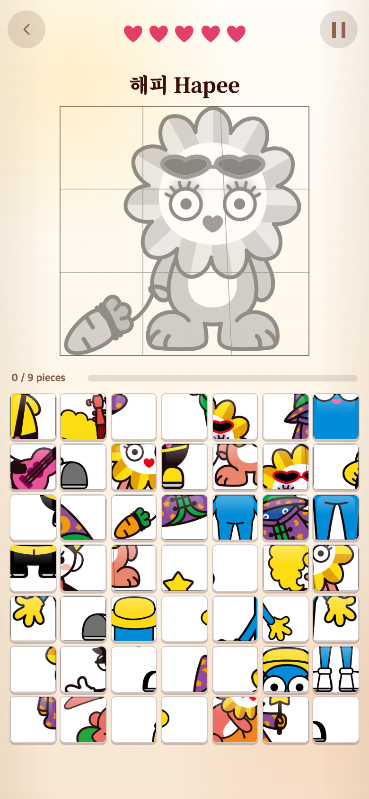
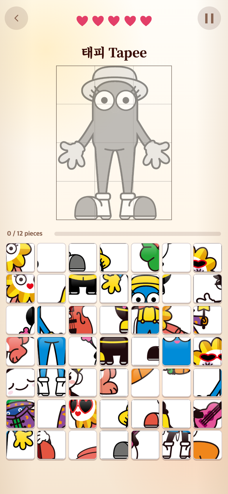
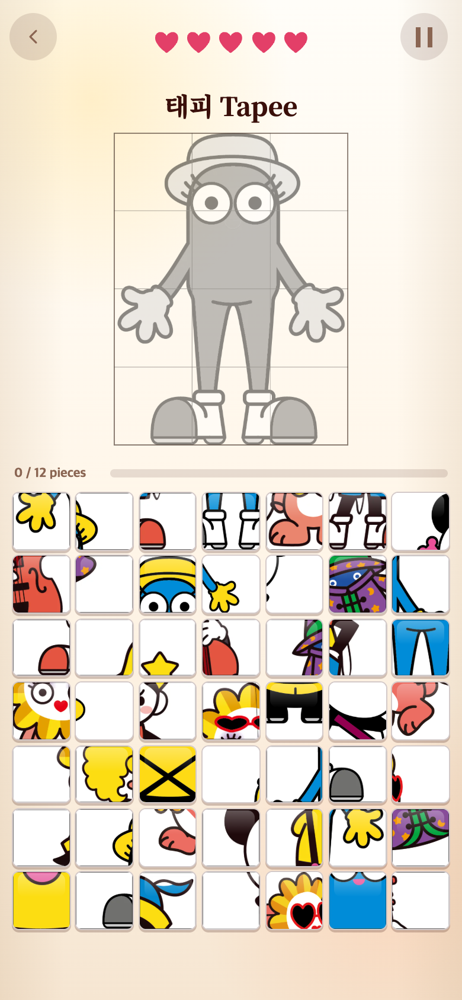

# PUZZLE 오답 난이도 배분 — 2026-09-29

## 문제와 요청

기존에는 목표 그림을 제외한 모든 조각을 함께 섞어 49칸을 채웠다. 같은 캐릭터의 앞·뒷모습이나 다른 포즈가 다수 섞이면 작은 차이를 계속 구분해야 했다. 사용자는 이런 어려운 오답을 1~2개만 두고, 나머지는 중간·쉬운 조각으로 구성하며 앞으로 추가하는 이미지에도 같은 규칙을 적용하기를 요청했다.

## 변경

| 목표 그림 | 정답 | 어려움 | 중간 | 쉬움 | 합계 |
| --- | ---: | ---: | ---: | ---: | ---: |
| 9조각 | 9 | 2 | 12 | 26 | 49 |
| 12조각 | 12 | 2 | 12 | 23 | 49 |

- 어려움: 같은 캐릭터의 **다른 그림**. 여러 포즈가 있어도 전체를 합쳐 최대 2조각이며 중간·쉬움 후보에서 제외한다.
- 중간: 다른 캐릭터지만 색이나 형태에 유사성이 있는 그림의 조각. 콘텐츠에 등록한 분류가 겹치는지 판단한다.
- 쉬움: 위 두 분류에 속하지 않는 다른 캐릭터의 조각.
- 어려운 후보가 1개/0개이면 쉬운 조각을 1개/2개 더 넣는다. 현재 뽀글스·재피·피노팬은 다른 그림이 없어 어려움이 0개다.
- 중간 후보가 부족해도 쉬운 조각으로 보충한다. 쉬운 조각까지 부족하면 중복이나 어려운 조각을 추가하지 않고 오류로 감지한다.
- 모든 정답을 한 번씩 포함하고 동일 조각 파일을 중복 사용하지 않는다. 후보 선택과 보드 위치는 매번 섞는다.

캐릭터별 색·형태 분류는 현재 이미지를 보고 정한 운영 기준이다. 개별 조각의 픽셀 유사도를 계산하거나 실제 이용자 난이도를 측정한 결과는 아니다. 노란색 둥근 형태, 흰 얼굴, 악기, 파랑/노랑 특징으로 나누었으며 향후 플레이 테스트에 따라 조정할 수 있다.

## 앞으로 추가하는 이미지

`src/content/puzzles.ts`의 `UNIT_MEMBER_PROFILES`에서 캐릭터 정보와 유사성 분류를 관리한다. `character(...)`로 새 그림을 등록하면 동일 멤버의 `memberId`를 물려받는다. 파일명이나 그림 ID가 달라도 같은 캐릭터인 한 앞/뒤·새 포즈를 모두 합쳐 어려운 오답 최대 2개 제한을 공유한다.

원본 보관 → WebP·9조각 생성 → 콘텐츠 목록 등록 → 테스트·모바일 검증 순서로 추가한다. 파일 업로드만으로 게임 목록에 자동 노출되지는 않는다. 새로운 캐릭터나 색·구도가 크게 다른 그림은 등록 단계에서 프로필을 검토한다. 자세한 절차는 [수정 안내](../../CUSTOMIZATION.md#이미지-규칙)에 기록했다.

## 변경 전후 화면

390×844 CSS 픽셀, DPR 2의 Chromium 모바일 에뮬레이션 캡처(780×1688 PNG)다. 실제 게임을 실행했으며 정답 표시나 난이도 색상 같은 디버그 장식을 화면에 추가하지 않았다. 스크린샷은 한 난수 시드의 사례이며 평균 난이도나 사용자 실험 결과가 아니다.

### 해피 9조각

이 사례에서는 같은 해피의 다른 그림이 **6조각 → 2조각**으로 제한된다.

| 변경 전: 정답 9 + 무작위 오답 40 | 변경 후: 정답 9 + 어려움 2 + 중간 12 + 쉬움 26 |
| --- | --- |
|  |  |

### 태피 12조각

기존의 완전 무작위 구성은 어떤 판에는 같은 캐릭터 오답이 없기도 했다(이 사례는 0개). 변경 후에는 후보가 있는 경우 2개를 사용해 판별 구성의 편차를 줄인다.

| 변경 전: 정답 12 + 무작위 오답 37 | 변경 후: 정답 12 + 어려움 2 + 중간 12 + 쉬움 23 |
| --- | --- |
|  |  |

## 검증

- `npm test`: **28개 테스트 파일, 290개 테스트 통과**. 순수 규칙에서 9/12조각·합산 상한·후보 부족·셔플·입력 불변·미래 포즈를 검증한다. 실제 콘텐츠 12종 × 50회 = 600개 보드에서 구성과 중복 여부를 확인했다.
- `npm run build`: 타입 검사 및 프로덕션 빌드 통과.
- 모바일 브라우저에서 기존 7종 + 추가 5종, 총 12종을 각각 실행했다. 정답 9/12개, 전체 49칸, 중간 12개, 같은 멤버 오답 최대 2개, 조각 URL 중복 없음, 정사각형 타일과 화면 안 배치를 확인했다.
- 각 그림에서 오답 1회에 하트 1개가 줄고 모든 정답 조각을 선택할 수 있음을 확인했다. 브라우저 실행 오류 0건.
- 재현을 위해 START의 목표 선택 난수와 보드 셔플 난수를 고정했다(LCG seed 12345). 게임 상태·타일 데이터를 직접 주입하거나 그림을 합성한 캡처가 아니다.

기존 12종 제시 목록·회색에서 컬러로 드러나는 표현·이미지 파일·5하트·기록·영상·게임 2/3·화면 디자인은 변경하지 않았다. 추가 이미지 요청이나 이미지 생성은 없으며 새 다운로드 에셋도 없다. 연구기록은 게임에서 읽지 않는다. TAPtoTALK과 TAPtoTEN은 수정하지 않았고 이 작업은 아직 푸시하지 않았다.
