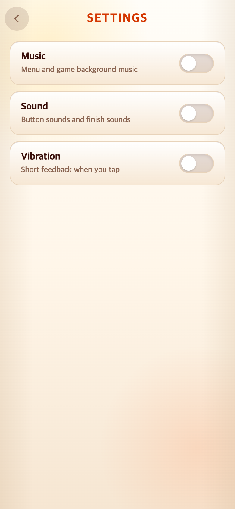
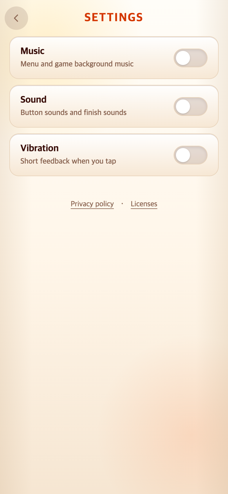

# TAPtoTEST · 앱 저장소와 Play 정책 문서

작업 시작: 2026-09-29, 검증·기록: 2026-09-30 KST. TAPtoTEN은 화면 참조로만 읽었으며 TAPtoTALK 원본 저장소는 수정하지 않았다. 다른 작업의 문서·presentation 파일은 이 변경에 포함하지 않는다.

## 문제 → 변경

| 기존 문제 | 적용한 변경 | 보존한 범위 |
| --- | --- | --- |
| Android 앱 표시명과 ID에 이전 이름이 남음 | Play에 아직 등록하지 않았다는 사용자 확인 후 TAPtoTEST / `io.github.junyyyong.taptotest`로 통일 | 폴더·origin·서명 설정·versionCode 1 |
| 기록·설정을 WebView localStorage에만 의존 | Android는 Preferences, 웹은 기존 localStorage. 같은 앱의 이전 웹 데이터 이관·읽기 검증·복구 사본·직렬 비동기 저장·실패 Retry | 정확한 기존 키 2개, 저장 내용과 최고 결과 비교 규칙. 새 서버 없음 |
| Settings에서 개인정보/오픈소스 문서를 볼 수 없음 | TEN과 같은 링크 및 로컬 HTML 읽기창, 영어·한국어 방침과 실제 의존성/두 서체 고지 | Music/Sound/Vibration 순서·게임 화면·START/결과 표시·규칙 |
| 초기 저장 실패 후 Retry 성공 시 숨긴 안내가 터치를 가로막음 | CSS 숨김 규칙을 blocking 규칙 뒤로 옮기고 hide에서 blocking 클래스도 제거 | 오류 데이터는 초기화하지 않고 재시도. 정상 클릭으로 복구 검증 |

이전 `io.github.junyyyong.taptopick`과 새 ID는 Android에서 **다른 앱**이다. 이전 패키지의 전용 데이터를 새 앱이 자동으로 가져오는 것은 지원하지 않는다. 같은 ID/서명 업데이트 보존은 실제 기기로 별도 검증해야 한다.

## 화면과 비교 방법

- 이전 화면: `git archive 36848af66490811127803f5400b3553e1df1982c`의 별도 임시 폴더를 실행했다. 원본 커밋 날짜는 2026-09-29 KST. 앱 소스는 해당 커밋 그대로이며 실행 도구용 node_modules는 현 작업 폴더를 연결했다.
- TEN 참조: `cae2e49b5af230a95b2f1890daf01b47b321b621`의 로컬 dist를 읽기 전용 서버로 제공했다. 저장소 변경 없음.
- 비교 화면: 390×844 CSS px, DPR 2, **PNG 780×1688px**, en-US, Asia/Seoul, 모바일 터치. 추가로 320×568 / 768×1024에서 잘림·닫기 검사.
- 서로 격리된 브라우저 저장소에 테스트 값만 넣었다. 실제 이용자 기록은 사용하거나 변경하지 않았다. 배경음악·소리를 끄고 진동 꺼짐 / 미지원 환경의 켜짐을 각각 비교했다.
- 전환 애니메이션이 끝난 뒤 좌표를 측정했다. Settings 내부의 6px 여백을 제거해 TEN의 링크 x/y·폭·높이·서체·두께를 맞췄다. 일반 화면 전환 효과는 변경하지 않았다.
- 최종 캡처·좌표·브라우저 버전·소스 SHA-256·파일 SHA-256은 `final/verification.json`에 기록한다. 캡처 시 HEAD는 수정 전 기준 커밋이며 after 화면은 그 위의 작업 트리다. 최종 코드는 이 폴더를 처음 추가한 Git 커밋으로 식별한다.

| 변경 전 Settings | 변경 후 Settings |
| --- | --- |
|  |  |

[TEN 비교 화면](final/reference-ten-settings.png) · [좁은 화면·진동 안내](final/after-settings-small-note.png) · [Privacy EN](final/after-privacy.png) · [Privacy KO](final/after-privacy-korean.png) · [Licenses](final/after-licenses.png) · [초기 읽기 실패](final/storage-read-retry.png) · [쓰기 실패](final/storage-write-retry.png)

## 저장·검증 범위

- `taptopick.preferences.v1`, `taptopick.records.v1` 및 기존/새 POSITION 기록을 보존한다. 초기 읽기·검증 완료 전 게임과 저장을 막고 복구 불가 데이터는 덮어쓰지 않는다.
- 처음 한 번 같은 앱의 WebView 데이터를 Preferences로 복사하고 웹 원본은 남긴다. 이후 native 값이 우선한다. 최신 저장 요청을 직렬로 반영하고 실패하면 대기열·메모리에 남겨 Retry한다. 비동기 저장 대기 자체를 실패로 표시하지 않는다.
- 브라우저에서 실제 Capacitor JS 어댑터에 **모의 native bridge**를 연결해 초기 읽기 실패→Retry→이관, 쓰기 실패→Retry, 재실행 시 native 우선과 기존 웹 데이터 보존을 검증한다. **실제 Android 설치·업데이트 시험은 아니다.**
- 문서 Close / 부모 및 iframe Escape / Settings 유지 / 누른 링크로 초점 복귀 / 외부 HTTP 0건 / 문서 보기 전후 저장값 일치 / 게임 시작 49·4·4칸을 확인한다.
- Android release manifest 병합·Java 컴파일·release 의존성 50개를 검사했다. 새 AAB를 만들거나 서명하거나 Play Console에 올리지 않았다. 서명 키 내용을 읽거나 복사하거나 기록하지 않았다.

### 검증 도중 발견한 사항

1. `attempt-1/`은 첫 실행의 부분 캡처다. Retry 성공 후 `[hidden]`보다 뒤의 `.storage-blocking` display 규칙이 이겨 화면이 터치를 가로막았다. 실제 결함으로 수정하고 강제 클릭 없는 회귀 검증을 추가했다.
2. `verified/`는 두 번째 실행의 부분 캡처다. TEN이 requestAnimationFrame에서 시작하는 전환을 너무 일찍 측정해 x=17.432가 나온 **검증 시점 오류**였다. 게임 코드를 바꾸지 않고 검사에서 자연스러운 전환 완료를 기다리도록 수정했다.
3. 성공한 최종 기록은 `final/`만 사용한다. 실패 시도 파일은 덮어쓰지 않고 별도로 보존한다.

### 최종 검증 결과

- 2026-09-30 00:13 KST: `npm test` **31개 파일·324개 테스트 통과**. `npm run typecheck` 통과.
- `npm run cap:sync`: 웹 프로덕션 빌드와 Android 에셋 복사·Preferences 8.0.1 플러그인 등록 통과. dist 및 Android 동봉 Privacy/Licenses가 public 원본과 바이트 단위로 일치했다.
- Gradle 8.14.3, offline: `:app:writeReleaseDependencyList`, `:app:processReleaseMainManifest`, `:app:compileReleaseJavaWithJavac` **BUILD SUCCESSFUL**. 56개 작업 중 최종 13개 실행·43개 최신 상태. SDK XML 버전 및 flatDir 경고가 있지만 오류는 없었다. bundle/signing 작업은 실행하지 않았다.
- Chrome **154.0.8037.58**, 최종 검사 시작 **2026-09-30 00:11:31 KST**: 7개 검사 그룹 통과, pageerror 0. 초기 읽기 Retry 후 패널 `display:none`, blocking 클래스 제거, app inert 해제 및 일반 Settings 클릭을 확인했다.
- 390×844에서 TEN/TEST 링크 영역은 모두 **x=16, y=327, 358×44**였다. Privacy 버튼은 **x=114.90625, 85.828125×44**, Licenses는 **x=217.59375, 57.5×44**, 글자는 **13px / 500**, 서체 목록이 일치했다. 미지원 진동 안내를 표시하면 양쪽 모두 y=361.796875다.
- 390×844 문서창도 양쪽 **x=19, y=42, 352×760**으로 일치했다. 좁은/넓은 화면의 문서 가로 넘침은 없었다.
- 최종 캡처에 기록한 9개 소스 해시가 빌드 후 작업 트리와 일치함을 다시 확인했다. 코드·문서의 staged diff 공백 검사는 통과했다. 공식 Noto Sans OFL 원문과 이를 그대로 포함한 licenses.html의 한 줄 끝 공백 2건은 원문 보존을 위해 유지했다. 프로덕션 의존성 audit 0건, 개발 도구 moderate 5건은 출시 확인표에 별도 남겼다.

## 정책·라이선스와 남은 출시 작업

실제 코드에 맞춘 EN/KO 방침, 동봉 Sans/Serif 라이선스 출처, Android 권한과 실제 의존성, Google 공식 정책 링크, 개발 도구 audit 및 소유자 확인사항은 [Play 출시 확인표](../../PLAY_POLICY_CHECKLIST.md)에 모았다. 정책 전면 준수나 심사 승인을 보장하는 문서는 아니다.

- 공개 정책 URL은 push 이후 별도 HTTP 확인이 필요하다: `https://taptotest.vercel.app/privacy.html`, `https://taptotest.vercel.app/licenses.html`.
- 새 ID의 최종 서명 AAB·Play Console 설문/업로드는 하지 않았다.
- 실제 Android에서 오프라인 플레이, 시스템 뒤로가기, 강제 종료/재실행, 같은 ID/서명 업데이트 및 백업/삭제를 별도로 검증해야 한다.

이 연구기록은 런타임에서 불러오지 않는다. 재검증은 기존 캡처를 덮어쓰지 않는 새 `CAPTURE_OUT` 경로로 `check.cjs`를 실행한다.
