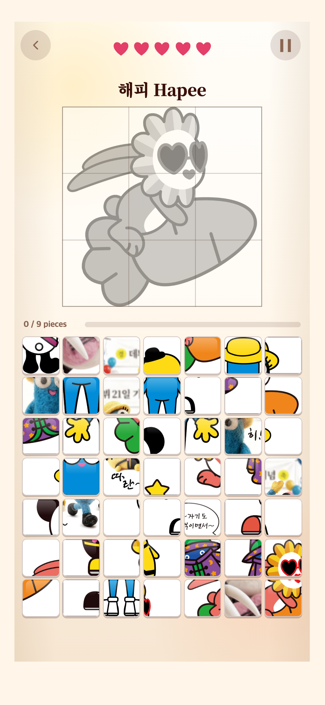

# Android 화면 확대 설정과 게임 비율

2026-10-01 · TAPtoTEST 1.0.3 / versionCode 5

휴대폰 설정이 달라져도 그림·글자·블록의 상대 크기와 간격을 유지하도록 Android 앱에 고정 비율 화면을 적용했다. **게임 안에 화면 크기나 배율을 조절하는 기능은 추가하지 않았다.** 웹의 기존 반응형 배치는 유지했다.

## 문제와 원인

사용자는 1.0.2/code4 설치본에서 PUZZLE의 제시 그림이 커지고 간격이 달라지며 보드 마지막 줄이 시스템 탐색 막대 아래에 가려진 화면을 제공했다. 이어 갤럭시의 디스플레이 ‘화면 크게/작게’ 설정과 증상이 연관된다고 확인했다.

Android의 화면 확대는 앱이 보는 논리 화면 크기에 영향을 준다. 기존 CSS는 viewport 높이 700px을 기준으로 제시 그림의 높이·여백을 바꿨으므로, 같은 물리 화면에서도 설정에 따라 다른 배치가 선택될 수 있었다. 설치 앱의 시스템바 안전영역도 브라우저와 다르다. 이는 사용자 관찰과 코드에 근거한 원인 분석이며, 실제 갤럭시에서 설정을 직접 바꿔 재현한 결과는 아니다. [Android 화면 밀도 설명](https://developer.android.com/training/multiscreen/screendensities)

직전 code4의 보드 크기 제한만으로는 제시 그림·글자·간격의 배치 분기까지 고정하지 못했다. 이번에는 일부 요소만 작게 만드는 대신 전체 구성의 비율을 고정한다.

## 변경 내용

- Android 앱은 **390×844 논리 화면**을 기준으로 전체 화면을 균일하게 맞춘다. 상태 막대·탐색 막대·화면 잘림 영역을 제외한 공간 안에 배치한다. 기기 종횡비가 다르면 남는 공간은 여백으로 둔다.
- `MainActivity`는 시스템바와 WebView의 위치를 비교해 실제로 아직 겹치는 영역만 전달한다. 이미 native padding으로 제외된 영역은 0으로 처리해 이중 여백을 막는다. 페이지 로딩·복귀·화면 변경 시 다시 계산한다.
- CSS의 그림·글자·블록은 같은 논리 크기를 공유하고, 높이에 따른 배치 분기는 실제 viewport 대신 기준 화면을 따른다. 보드 측정도 화면 배율을 보정한다. [container query 설명](https://developer.chrome.com/blog/has-with-cq-m105)
- 게임 안에 크기 조절 버튼·슬라이더는 없다. 휴대폰 설정을 바꾸거나 OS density/fontScale을 덮어쓰지 않는다. 기존 WebView 글자 배율 100% 정책은 유지한다.
- 웹은 기존 배치를 유지한다. container query 미지원 구형 WebView는 기존 반응형 방식으로 돌아간다.

게임 규칙, 캐릭터/이미지 목록, 서체, 결과 영상 선택, 현재·최고 기록 저장 형식, 앱 ID와 업로드 서명 키는 변경하지 않았다. 다른 게임 저장소는 수정하지 않았다.

## 검증 결과

동일한 물리 화면 1080×2340에서 표시 밀도를 바꾼 조건을 브라우저로 모의했다. 시스템바는 물리 기준 위 72px·아래 144px로 설정했다. 실제 갤럭시 설정 단계와 수치가 동일하다는 뜻은 아니다.

| 모의 밀도 | WebView 논리 화면 |
| --- | --- |
| 2 | 540×1170 |
| 2.4 | 450×975 |
| 3 | 360×780 |
| 3.6 | 300×650 |
| 4 | 270×585 |

최종 검사는 **110개 검사·12개 캡처·오류 0개**다. [전체 측정 결과](final/verification.json)

- 메뉴, START, PUZZLE, 일시정지, PORTRAIT의 2×2/3×3/4×4/5×5, POSITION의 2×2/4×4/6×6, 결과, Settings와 정책 문서를 확인했다.
- transform된 화면에서 실제 좌표 기반 터치로 정답 선택·단계 진급·메모리 완주를 검사했다.
- 실행 중 밀도 변경, env/native inset의 부재·0·겹침 조합, 해피 당근 9조각과 기존 태피 12조각을 확인했다.
- 기존 code4 AAB에서 추출한 웹과 390×844, 360×780, 320×650, 390×700, 390×701 화면을 비교했다. 웹 배치·서체는 오차 1px 이내로 동일했다.
- Vitest **34개 파일·343개 테스트**와 typecheck/build/Android sync가 통과했다.

초기 검사 결과는 `attempt-1/`에 별도로 보존했다. 최종 결과는 `final/`만 사용한다.

## 모바일 화면

아래 파일은 모두 **1080×2340px 브라우저 모의 화면**이다. 실제 기기 상태 막대/탐색 버튼을 촬영한 화면은 아니다. 두 밀도 조건에서 전체 구성의 상대 크기·간격과 보드가 유지되는지 비교했다.

| 화면 | 밀도 2 | 밀도 4 |
| --- | --- | --- |
| 메인 | [메인](final/density-2-menu.png) | [메인](final/density-4-menu.png) |
| PUZZLE | [퍼즐](final/density-2-puzzle.png) | [퍼즐](final/density-4-puzzle.png) |
| PORTRAIT | [초상화](final/density-2-portrait.png) | [초상화](final/density-4-portrait.png) |
| POSITION | [위치](final/density-2-position.png) | [위치](final/density-4-position.png) |
| 결과 | [결과](final/density-2-result.png) | [결과](final/density-4-result.png) |

사용자가 제공한 문제 화면과 같은 그림인 해피 당근에서 마지막 줄까지 보이는 모의 화면:

기존 12조각 태피도 같은 기준을 사용한다. [태피 12조각 화면](final/density-3-Tapee.png)

## 새 앱 파일과 남은 확인

- 파일: `android/releases/TAPtoTEST-1.0.3-code5-20261001.aab`
- versionName: `1.0.3`, versionCode: `5`
- applicationId: `io.github.junyyyong.taptotest`
- SHA-256: `cf65ccc675a12b1fed141d20549d60becd21a56c3e6677ba2a319ccc0e18417e`
- 기존 업로드 인증서 사용, 서명된 payload 866개·최신 웹 파일 437개·설치 아이콘 15개·bundletool validate·앱 ID/버전·DEX의 새 native 측정 코드 검증 통과. 이전 AAB는 변경하지 않았다. [AAB 검증 보고서](release-verification.json)

**실제 Android 기기가 연결되어 있지 않아 갤럭시에서의 화면 확대 설정 변경, 설치본 업데이트 후 기록 유지, 실제 시스템바 겹침은 아직 검증하지 못했다.** Play 내부 테스트에 새 AAB를 올린 뒤 기존 앱을 삭제하지 않고 업데이트하여 확인해야 한다. AAB는 휴대폰에서 직접 설치하는 APK가 아니다.

이번 작업은 로컬 코드·서명 AAB·연구기록까지 완료했다. Git commit/push와 Google Play 업로드는 하지 않았다.
